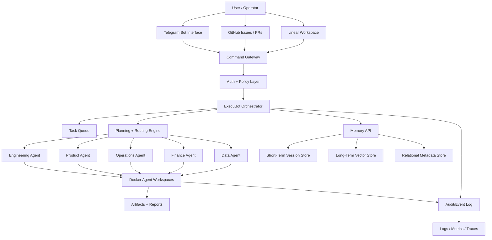

# System Architecture

## Objective

ExecuBot Kernel v0.1 provides the control plane for a Docker-based AI agent orchestration platform. The first release should make task intake, routing, memory access, observability, and agent boundaries explicit before adding advanced automation.

## Architecture Diagram

## Core Components

| Component | Responsibility | Phase 1 Output |
| --- | --- | --- |
| Command Gateway | FastAPI service that normalizes inputs from Telegram, GitHub, and Linear. | Interface contract only |
| Auth + Policy Layer | Checks operator identity, command scope, and agent permissions. | Policy model |
| ExecuBot Orchestrator | Creates tasks, selects agents, tracks state, handles escalation. | Agent spec |
| Planning + Routing Engine | Converts goals into agent-addressable work packets. | Routing rules |
| Task Queue | Redis Streams dispatch between orchestrator and agents. | Docker plan |
| Agent Workspaces | Isolated containers with tools, mounts, and execution limits. | Folder contract |
| Memory API | PostgreSQL-backed read/write abstraction for working, project, and historical memory. | Memory design |
| Audit/Event Log | Append-only `audit_events` table for commands, decisions, approvals, and state changes. | Event schema outline |
| Observability | Logs, metrics, traces, health checks, and runbook signals. | Operations backlog |

## Accepted Technology Stack

- API: Python with FastAPI.
- Worker: Python worker service.
- Queue: Redis Streams.
- Database: PostgreSQL.
- Migrations: Alembic.
- Memory/vector store: PostgreSQL first, `pgvector` later.
- Telegram: `python-telegram-bot`.
- Local environment: Docker Compose with `.env` for local secrets only.

## Agent Interaction Model

1. A command enters through Telegram, GitHub, Linear, or a future API.
2. The Command Gateway converts it into a normalized command envelope.
3. The policy layer validates identity, project scope, and allowed actions.
4. ExecuBot creates a task, assigns priority, and chooses an agent or agent sequence.
5. Specialist agents work inside Docker-isolated execution contexts.
6. Agent outputs are written as artifacts, summaries, memory updates, and audit events.
7. ExecuBot reports progress and asks for human approval when a policy requires it.

## Boundary Principles

- ExecuBot coordinates; it does not perform every specialist task itself.
- Agents communicate through typed task packets, memory APIs, and event logs.
- Memory is accessed through services, not direct database coupling.
- Container boundaries are part of the security model.
- Human approval is required for irreversible external actions in early releases.
- Human approval is also required for external actions, shell commands, GitHub writes, financial actions, email/SMS, and deployments.

## v0.1 Non-Goals

- No autonomous production deployments.
- No direct financial transactions.
- No unrestricted shell execution.
- No multi-tenant billing.
- No advanced self-improvement loops.
- No long-running unattended external actions without approval gates.
